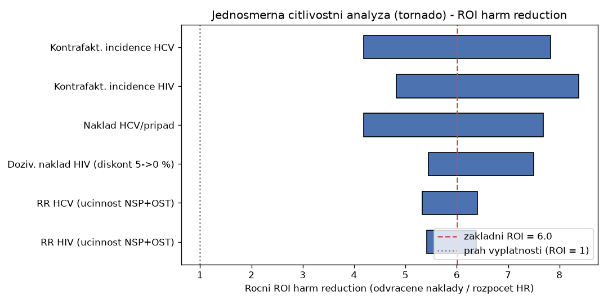

# Harm reduction vs. represe v drogové politice ČR — datový rozbor a nákladová kalkulace

*Kvantitativní podklad k tezi, že přístup zaměřený na snižování rizik (harm reduction) a léčbu je v České republice prokazatelně výhodnější než represe.*

Datum zpracování: červen 2026. Verze: **3**. Jazyk: čeština. Zaměření: primárně ČR, doplněno o mezinárodní benchmark.

> **Reprodukovatelnost (v3):** Všechna modelová čísla v sekci 5 jsou generována z parametrizovaného skriptu `harm_reduction_model.py` (jeden zdroj pravdy) — vstupy jsou pojmenované proměnné se zdrojem nebo statusem `[DOPLNIT ZDROJ]`, skript je spustitelný a deterministický a ukládá citlivostní graf `tornado.png`. Tabulky níže odpovídají jeho výstupu.

> **Stav ověření (aktualizováno):** Klíčová zdravotní, justiční a rozpočtová data **za rok 2024** jsou nově **oficiálně potvrzena** z primárních zdrojů: *Souhrn Zprávy o nelegálních drogách v ČR 2025* (data za rok 2024) **[R32]**, *Výroční zpráva Národní protidrogové centrály 2024* **[R33]** a *Výroční zpráva Vězeňské služby ČR 2024* **[R34]**. Takto potvrzené údaje jsou značené **✔**. Údaje bez značky pocházejí ze starších studií, sekundárních zdrojů nebo mezinárodní literatury (vždy uveden zdroj).

---

## 0. Hlavní závěr (executive summary)

Na základě dostupných českých i mezinárodních dat lze tezi **kvantitativně podpořit**. Tři nejsilnější, nejlépe doložitelné body:

1. **Jednotkové náklady (tvrdá ČR data):** rok ve vězení stojí v ČR **≈ 687–699 tis. Kč** (✔ rozpočet VS ČR 2024 **13,35 mld. Kč** ÷ ✔ **19 430 vězňů** ≈ 687 tis. Kč/rok ≈ 1 880 Kč/den; oficiální per-diem 1 916 Kč/den za 2023), zatímco rok substituční léčby **≈ 35–73 tis. Kč** — tedy **≈ 10–20× méně** (podle nákladu substituce). I pobytová léčba v terapeutické komunitě (~180 000 Kč/rok) je **~4× levnější** než věznění. Jde o srovnání *jednotkových nákladů intervencí*, ne o tvrzení „HR je 10–20× levnější než represe jako celek" (viz asymetrie, 3.5).
2. **Výsledky harm reduction jsou v ČR mimořádně dobré a úsporné:** ✔ z **269 nových případů HIV v r. 2024** bylo jen **6 (≈ 2 %)** přeneseno injekčním užíváním (kumulativně 179 případů od r. 1985); drogová mortalita je dlouhodobě **hluboko pod průměrem EU**. ✔ V r. 2024 navíc distribuce naloxonu **odvrátila 218 předávkování opioidy**. Každá odvrácená nákaza HIV ušetří řádově **miliony Kč** celoživotní léčby.
3. **Léčba a snižování rizik dominují ve výdajích na služby, ale represe pohlcuje většinu integrovaného rozpočtu:** ✔ z 1 631,1 mil. Kč na *adiktologické služby* (2024) šlo **31,4 % na harm reduction** a **28,3 % na léčbu** — ovšem tato čísla **nezahrnují** policii/soudy/věznice. Když se do rozpočtu započte i represe (Akční plán, data 2021), spotřebuje **prosazování práva ~52 %** celku.

**Verdikt (formulovaný jako asymetrie, ne jako poměr):** Tvrdá česká jednotková data i recenzovaná mezinárodní evidence (návratnost investice do výměnných programů **2–7×**, substituce pod **20 000 USD/QALY**, léčba až **7× nákladově efektivnější než věznění** — *zahraniční číslo, RAND*) konzistentně ukazují, že harm reduction a léčba mají **doložený kladný výnos**: vracejí víc, než stojí. Represe naproti tomu spotřebovává největší díl integrovaného rozpočtu (~52 %) na nejdražší intervenci s nejvyšší recidivou (64–70 %) — a přitom **nemá doložený měřitelný zdravotní výstup** (přísnost sankcí spotřebu nesnižuje; **[R35]**, **[R36]**). To je jádro argumentu: ne „X-krát levnější", ale **asymetrie** — jedna alokace má doložený návrat, druhá je čistý náklad bez měřeného zdravotního přínosu. Posun marginální koruny od represe k harm reduction/léčbě proto zvyšuje návratnost systému.

> **Metodická poctivost:** **Oficiální český výpočet poměru „HR je X-krát levnější než represe" neexistuje** — Národní strategie 2019–2027 takovou cost-effectiveness analýzu teprve *ukládá jako budoucí úkol* (s. 28 **[R37]**). Tento rozbor je proto vlastní syntéza českých vstupů a mezinárodních effect sizes, ne oficiální číslo, a tak ho i prezentuji. Data za rok 2024 jsou ověřena z primárních PDF NMS/NPC/VS ČR (viz [R32], [R33], [R34]). Rozpočet vězeňství 2024 (✔ 13,35 mld. Kč) i počet vězňů (✔ 19 430) jsou nově oficiální; dopočet nákladu na vězně je hrubý (rozpočet ÷ stav) — oficiální nákladový per-diem VS samostatně nezveřejňuje. Cena substituce zůstává na úhradových/sekundárních zdrojích, byť VZP výdaj na léčbu nelegálních drog je nově ověřen (✔ 527 mil. Kč, 2024 **[R32]**). Modelové kalkulace v sekci 5 jsou **ilustrativní scénáře** s explicitními předpoklady, nikoli přesná oficiální čísla — kontrafaktuál (co by se stalo bez harm reduction) opírám o přirozený experiment, ne o pouhý předpoklad (viz 5.2).

---

## 1. Ekonomika: náklady a rozdělení rozpočtu

### 1.1 Společenské náklady užívání nelegálních drog v ČR

| Položka | Hodnota | Rok / zdroj |
|---|---|---|
| **Společenské náklady — nelegální drogy** | ✔ **5,6–6,7 mld. Kč** | oficiálně potvrzeno ve Zprávě 2025 **[R32]** |
| Výdaje domácností na nelegální drogy | ✔ **~10 mld. Kč/rok** (0,3–0,5 % výdajů domácností) | **[R32]** |
| Detailní rozpad (kontext: tabák 33,1 mld., alkohol 16,4 mld.; vše 56,2 mld. = 1,6 % HDP) | 6,7 mld. (drogy) | studie 2007 **[R1]**; potvrzeno NAUTA 2022 **[R41]** |
| Podíl nepřímých nákladů (ztracená produktivita) u drog | **57,2 %** | studie 2007 **[R1]** |

Zdroj detailní struktury: Zábranský et al. (2011): *Společenské náklady užívání alkoholu, tabáku a nelegálních drog v ČR v roce 2007* **[R1]**; novější analýza NAUTA 2022 dochází ke stejnému řádu (celkem 56,2 mld. Kč, z toho drogy 6,7 mld.) **[R41]**. **Aktuální** vyčíslení 5,6–6,7 mld. Kč potvrzuje Zpráva 2025 **[R32]**.

### 1.2 Rozpočet: dvě metodiky — pozor na záměnu

Existují **dva různé pohledy** na rozpočet a je nutné je nezaměňovat:

**A) Integrovaný rozpočet (včetně represe)** — Akční plán 2023–2025, data ~2021, celkem ≈ **2,3 mld. Kč** **[R2]**; rozpad výdajů podle resortů včetně policie a NPC dokládá i NMS *Zaostřeno* 6/2020 **[R42]**:

| Oblast | Podíl 2021 | Podíl 2017 |
|---|---|---|
| **Prosazování práva (represe / snižování nabídky)** | **52 %** | **59 %** |
| Snižování rizik / harm reduction | 16 % | 14 % |
| Léčba uživatelů drog | 12 % | 9 % |
| Záchytné stanice | 6 % | — |
| Následná péče | 5 % | — |
| Prevence | 4 % | 4 % |
| Ostatní / nespecifikováno | ~5 % | — |

> Pozn.: uvedené položky 2021 se sčítají na ~95 %; zbývajících ~5 % připadá na *ostatní/nespecifikované* výdaje a zaokrouhlení. Podstatné pro argument je, že **prosazování práva tvoří ~52 %** — víc než harm reduction a léčba dohromady.

**B) Výdaje na adiktologické *služby* (BEZ policie/soudů/věznic)** — ✔ ověřeno, rok 2024, celkem **1 631,1 mil. Kč** **[R32]**:

| Oblast (jen služby) | Podíl 2024 |
|---|---|
| **Služby minimalizace rizik (harm reduction)** | ✔ **31,4 %** |
| Ambulantní a rezidenční léčba | ✔ **28,3 %** |
| Provoz záchytných stanic | ✔ 13,2 % |
| Následná péče | ✔ 9,9 % |
| Domovy se zvláštním režimem | ✔ 9,9 % |
| Prevence | ✔ 6,6 % |
| Koordinace a výzkum | ✔ 0,7 % |

> Rozpad B (1 631,1 mil. Kč) je z toho: státní správa **1 054,3 mil.** (z toho MPSV 716,1; ÚV ČR 322,0; MZ 8,6; MSp 3,6; MŠMT 4,0), kraje **466,4 mil.**, obce **110,4 mil.** ✔ **[R32]**. **Důležité:** kategorie „Protidrogová politika" byla ve státním rozpočtu **zrušena**, takže výdaje na represi (policie, justice, vězeňství) se už samostatně nesledují — proto je nejnovější celkový poměr „represe vs. služby" nutné opřít o starší integrovaný Akční plán (frame A).

**C) Úhrady zdravotního pojištění (mimo frame A i B)** — ✔ ověřeno, rok 2024 **[R32]**: VZP vydala na léčbu poruch z užívání návykových látek celkem **1 592 mil. Kč**, z toho **1 004 mil. Kč alkohol**, ✔ **527 mil. Kč nelegální drogy**, 49 mil. Kč sedativa/hypnotika a 11 mil. Kč tabák. Tento zdravotně-pojišťovenský tok jde *nad rámec* sítě adiktologických služeb (frame B) — skutečné veřejné výdaje na léčbu jsou tedy vyšší, než ukazuje samotný frame B.

**Klíč:** V rámci *služeb* (frame B) harm reduction + léčba jednoznačně dominují (60 % výdajů). V *celém* systému (frame A) ale **represe pohlcuje ~52 %** — tedy víc než harm reduction (16 %) a léčba (12 %) dohromady. Právě tento nepoměr je terčem argumentu. (Pro kalibraci: i kdyby se k léčbě přičetlo celých ✔ 527 mil. Kč úhrad VZP za nelegální drogy, řádově to nepřeváží náklady represe — samotný rozpočet vězeňství je ✔ **13,35 mld. Kč**, tedy ~25× více.)

Pro úplnost — výstup represe (NPC, 2024): policie zkonfiskovala drogy v hodnotě ✔ **401,6 mil. Kč**, celková „újma" zločineckým skupinám ✔ **542,4 mil. Kč** **[R33]**.

### 1.3 Jednotkové náklady intervencí (ČR)

| Intervence | Náklad | Rok / spolehlivost |
|---|---|---|
| **Věznění — 1 osoba (dopočet)** | ✔ **≈ 687 000 Kč/rok ≈ 1 880 Kč/den** (rozpočet ÷ stav) | 2024, VS ČR **[R34]** |
| Věznění — oficiální per-diem | 1 916 Kč/den ≈ 699 000 Kč/rok | 2023, VS ČR **[R4]** |
| **Provoz celého vězeňství** | ✔ **13,35 mld. Kč** (čerpáno; rozpočet po změnách 13,51 mld.) | 2024, VS ČR **[R34]** |
| Terapeutická komunita (pobytová léčba) | ~15 000 Kč/měs. ≈ **~180 000 Kč/rok** | odhad, ceníky poskytovatelů |
| **Substituční léčba (komplexní péče)** | **~35 000 Kč/pacient/rok** | hrazeno pojišťovnami **[R5]** |
| Ambulantní substituce (buprenorfin) | ~24 000–73 000 Kč/rok | odhad |
| *Kontext: úhrada VZP za léčbu nelegálních drog* | ✔ *527 mil. Kč celkem (2024)* | NMS/VZP **[R32]** |

> **Náklad harm reduction na klienta/rok (proxy):** rozpočet „snižování rizik" ✔ 31,4 % z 1 631,1 mil. = **512 mil. Kč**, dělený ✔ ~41 000 klienty ≈ **~12 500 Kč/klient/rok** — viz kalkulace 5.2.

---

## 2. Zdraví: dopady harm reduction (nejsilnější ČR důkaz)

> Populační kontext (✔ 2024 **[R32]**): rizikově užívá drogy **47,5 tis.** osob (38,2 tis. pervitin; 9,3 tis. opioidy — z toho buprenorfin 4,5 tis., heroin 3,1 tis.); **injekčně ~42,5 tis.** (≈ 90 % rizikových uživatelů).

### 2.1 HIV a HCV mezi injekčními uživateli (PWID)

| Ukazatel | Hodnota | Rok | Zdroj |
|---|---|---|---|
| **Nové případy HIV celkem** | ✔ **269** | 2024 | NMS **[R32]** |
| **z toho přeneseno injekčním užíváním** | ✔ **6** (+ 15 osob s injekční anamnézou) | 2024 | NMS **[R32]** |
| Kumulativně HIV injekční cestou (od 1985) | ✔ **179 případů** | 1985–2024 | NMS **[R32]** |
| Prevalence HIV mezi PWID (séroprevalence) | **pod 1 %** (dlouhodobě „blízko nule") | dlouhodobě | EMCDDA / Mravčík **[R6]** |
| **Nové případy HCV celkem** | ✔ **1 445** | 2024 | NMS **[R32]** |
| **z toho mezi injekčními uživateli** | ✔ **668 (46 %)** | 2024 | NMS **[R32]** |
| Anti-HCV séroprevalence (760 PWID, 9 krajů) | ~30–35 % | 2002–05 | Zábranský et al., *Eur Addict Res* **[R8]** |
| Věznění jako rizikový faktor HCV | **4,3× vyšší** šance pozitivity | tamtéž | tamtéž |

ČR patří k evropské špičce v nízké HIV prevalenci mezi PWID — důsledek **brzy a hustě zavedené sítě výměnných programů**. Z 269 nových HIV v r. 2024 jen 6 (≈ 2 %) připadlo na injekční přenos, což je v Evropě výjimečně nízký podíl. (Pro srovnání: Portugalsko mělo před reformou ~900–1 000 nových HIV/rok mezi PWID — viz sekce 4.)

### 2.2 Rozsah služeb harm reduction v ČR (✔ 2024)

| Ukazatel | Hodnota | Rok | Zdroj |
|---|---|---|---|
| Klienti nízkoprahových programů | ✔ **41,0 tis.** (z toho injekčních 36 tis.) | 2024 | NMS **[R32]** |
| Vydané injekční stříkačky | ✔ **9,1 mil. ks** = 213/injekčního už. (dle WHO „vysoké pokrytí") | 2024 | NMS **[R32]** |
| **Naloxon (nosní sprej Nyxoid)** | ✔ **982 dávek; 218 odvrácených předávkování opioidy** | 2024 | NMS **[R32]** |
| Nízkoprahová kontaktní centra | ✔ 55–60 + 50–60 terénních programů | 2024 | NMS **[R32]** |
| Pacienti v substituci (OAT, registr) | ✔ **1 991 osob** (+ 1 957 psych. ambulance); 20–40 % rizik. opioidových už. | 2024 | NMS **[R32]** |

### 2.3 Drogová mortalita

| Ukazatel | Hodnota | Rok | Zdroj |
|---|---|---|---|
| **Smrtelná předávkování (registr mortality)** | ✔ **73** (nelegální drogy/těkavé látky 52: opioidy 30 [z toho heroin/morfin 6], pervitin/amfetamin 27; benzodiazepiny 21) | 2024 | NMS **[R32]** |
| Nefatální intoxikace | ✔ 675 (z toho 380 nelegální drogy) | 2024 | NMS **[R32]** |
| Drogová mortalita 15–64 (ČR), *věkově standardizovaná* | **4,29 / mil.** | 2016 | EMCDDA **[R10]** |
| Drogová mortalita 15–64 (ČR), *crude dopočet* | ~**11 / mil.** (52 úmrtí na nelegální drogy ÷ ~6,6 mil. obyv. 15–64) | 2024 | dopočet z NMS **[R32]** |
| Průměr EU (věkově standard.) | **~18–22 / mil.** | 2023 | EUDA |

> Pozn.: hodnoty **nelze přímo srovnávat** — 4,29/mil. je věkově standardizovaná (2016), crude dopočet za 2024 (~11/mil.) používá jiný jmenovatel a metodiku. Obě jsou ale **pod průměrem EU** (věkově standardizovaný ~18–22/mil.). ČR má drogovou mortalitu dlouhodobě nízkou — mj. proto, že dominuje metamfetamin (ne opioidy) a díky pokrytí harm reduction službami.

### 2.4 Vědecká evidence účinnosti (recenzované systematické přehledy)

| Intervence | Efekt | Zdroj |
|---|---|---|
| **OST → riziko HIV** | **−54 %** (RR 0,46; 95% CI 0,32–0,67) | MacArthur et al., *BMJ* 2012 **[R11]** |
| **NSP → přenos HIV** | **−48 %** (95% CI 3–72 %) | Aspinall et al., *Int J Epidemiol* 2014 **[R12]** |
| **OST → akvizice HCV** | **−50 %** (RR 0,50) | Platt et al., *Cochrane* 2017 **[R13]** |
| **NSP + OST → HCV** | **−74 %** (RR 0,26) | tamtéž |
| Vysoké pokrytí NSP (Evropa) → HCV | −76 % | tamtéž |
| **OST → celková mortalita** | **−50 %+** (během léčby výrazně nižší riziko úmrtí; ~2× vyšší mortalita mimo léčbu) | Sordo et al., *BMJ* 2017 **[R39]** |
| **OAT → mortalita (přehled 15 mil. osoboroků)** | nižší úmrtnost ze všech příčin i z předávkování při setrvání v léčbě | Santo et al., *JAMA Psychiatry* 2021 **[R40]** |

### 2.5 Cena odvrácené nákazy (kolik se ušetří)

| Ukazatel | Hodnota | Zdroj |
|---|---|---|
| Celoživotní náklad léčby 1 HIV (UK, diskontovaný) | **£185 200 (~4–5 mil. Kč)** | *PLOS One* 2015 **[R14]** |
| Celoživotní náklad 1 HIV (USA, model) | ~420 000 USD | Bingham et al. |
| Náklad na 1 odvrácenou HIV — NSP | **~487–34 278 USD** (dle země/modelu) | Alistar et al.; Holtgrave et al. **[R15]** |
| DAA léčba HCV / pacient (list. cena) | ~35 000 € | model EU |

**Ekonomická logika:** zabránit jedné nákaze stojí stovky až nízké tisíce USD; léčit ji stojí statisíce. Rozdíl je samotnou podstatou úspory harm reduction.

---

## 3. Kriminalita a justice

### 3.1 Náklady a rozsah represe (✔ 2024)

| Ukazatel | Hodnota | Rok | Zdroj |
|---|---|---|---|
| **Rozpočet vězeňství (čerpáno)** | ✔ **13,35 mld. Kč** | 2024 | VS ČR **[R34]** |
| **Stav vězněných osob (k 31.12.)** | ✔ **19 430** (z 19 569 v 2023) | 2024 | VS ČR **[R34]** |
| Náklad na 1 vězně (dopočet rozpočet ÷ stav) | ✔ **≈ 687 tis. Kč/rok ≈ 1 880 Kč/den** | 2024 | VS ČR **[R34]** |
| **Drogově závislí / uživatelé drog ve věznicích** | ✔ **14 402** (z 13 052 v 2023; ≈ **30 %** populace věznic) | 2024 | VS ČR **[R34]** |
| Adiktologická a substituční péče ve věznicích | ✔ substituce v **10** věznicích, adiktologové v **11** jednotkách, dobrovolné léčení v **11** věznicích | 2024 | VS ČR **[R34]** |
| HIV+ / úmrtí mezi vězněnými | ✔ **55** HIV+ / **57** úmrtí (vs. 58 / 53 v 2023) | 2024 | VS ČR **[R34]** |
| **Primární drogové TČ (registrované)** | ✔ **4,2 tis.** (2 % všech TČ) | 2024 | NMS **[R32]** |
| **Odsouzeno za primární drogové TČ** | ✔ **2 545 osob** (podmíněné tresty 53 %, nepodmíněné 26 %) | 2024 | NMS **[R32]** |
| Zadržení za § 284 (držení pro vlastní potřebu) | ✔ **21 %** zadržených za primární drogové TČ (roste) | 2024 | NMS **[R32]** |
| **Přestupky za nelegální látky** | ✔ **10 369** (+2 %), většinou držení malého množství | 2024 | NMS **[R32]** |
| Léčba ve věznicích (dobrovolná / ochranné léčení) | ✔ 571 / 208 osob; 11 věznic | 2024 | NMS **[R32]** |

> **Tři různá čísla nákladů represe — nezaměňovat:**
> 1. **Celý rozpočet vězeňství:** ✔ **13,35 mld. Kč** (VS ČR 2024) — *kontext systémových nákladů*, ne drogové.
> 2. **Náklad na uvězněné uživatele:** ~**9,9 mld. Kč/rok** = ✔ 14 402 závislých × ~687 tis. Kč/rok = **~74 % celého rozpočtu vězeňství**. ⚠️ **Většina těchto osob je odsouzena za jinou trestnou činnost spojenou se závislostí, ne za drogový TČ** — číslo vyjadřuje *náklad systému na uvězněné uživatele*, nikoli náklad represe drogových TČ. (Dobrovolnou léčbu uvnitř dostalo jen ✔ 571 osob.)
> 3. **Drogově přiřaditelné výdaje represe** (Národní protidrogová centrála + drogová agenda policie) — *to je správné číslo pro argument asymetrie a oportunitního nákladu*. Status: **[DOPLNIT ZDROJ — NMS *Zaostřeno* 6/2020 [R42], konkrétní položka a rok]**.
>
> Argument asymetrie (3.5) a oportunitního nákladu se vztahuje k číslu **(3)**, ne k celému vězeňství; čísla (1) a (2) slouží jen jako kontext měřítka.

### 3.2 Právní rámec — ČR dekriminalizuje a postupně liberalizuje

- Držení **„malého množství" pro vlastní potřebu = přestupek**, nikoli trestný čin. Účinné od **1. 1. 2010** (nař. vlády **467/2009 Sb.**; trestní zákoník **§ 284/§ 285**). **[R16]**
- ✔ **Novela (od 1. 1. 2025):** přestupkové pokuty za neoprávněné nakládání s konopím / novými látkami **zvýšeny až na 50 000 Kč**; nově definovány psychomodulační (PML) a zařazené psychoaktivní látky (ZPL). **[R32]**
- ✔ **Novela TZ (od 1. 1. 2026):** **léčebné využití psilocybinu** a **částečná legalizace konopí** pro osoby >21 let — držení až **100 g** a pěstování **3 rostlin** pro vlastní potřebu; nové skutkové podstaty § 283a, § 285a, § 286a. **[R32]**
- Ústavní soud dříve zrušil zmocnění vlády stanovovat hranice nařízením; „množství větší než malé" určuje judikatura (NS, Tpjn 301/2013). **[R17]**

To je důležité: **ČR se v rovině práva posouvá od represe k regulaci**; těžiště sporu „represe vs. harm reduction" leží v **alokaci peněz a praxi vymáhání**, ne v kriminalizaci uživatelů.

### 3.3 Recidiva

| Po čem | Recidiva | Zdroj |
|---|---|---|
| **Po věznění (ČR)** | **~64–70 %** (dle metodiky) | IKSP / VS ČR **[R18]** |
| Drogové soudy (drug courts) | pokles z 50 % na 38 % | RAND **[R19]** |
| Léčba vs. věznění (poměr recidivy) | 0,72 vs. 1,35 (nižší u léčby) | Open Society Foundations **[R20]** |

### 3.4 Mezinárodní evidence: léčba vs. věznění

| Tvrzení | Hodnota | Zdroj |
|---|---|---|
| **Léčba vs. domácí vymáhání práva** | **léčba 7× nákladově efektivnější** | RAND **[R19]** |
| Návratnost investice do léčby | **4–7 USD úspor na kriminalitě** na 1 USD; až 12 USD se zdrav. úsporami | NIDA/NIH **[R21]** |
| Účinek léčby | kriminální aktivita −až 80 %, zatčení −až 64 % | NIDA |
| Prevence | 1 USD ušetří až 10 USD | UNODC **[R22]** |

### 3.5 Proč se represe nepočítá jako „poměr" — chybějící zdravotní výstup

Klíčový metodický bod: nákladovou efektivitu represe **nelze** spočítat jako poměr „náklad na jednotku přínosu", protože **jmenovatel chybí** — represivní vymáhání nemá doložený měřitelný zdravotní výstup.

- Přehledová kriminologická literatura konzistentně ukazuje, že **přísnost** sankcí (delší/tvrdší tresty) **spotřebu drog ani kriminalitu významně nesnižuje**; odstrašující efekt plyne nanejvýš z *jistoty* postihu, ne z jeho přísnosti. Nagin (2013) **[R35]**; National Research Council (2014) **[R36]**.
- Důsledek pro tento rozbor: zatímco u harm reduction lze spočítat náklad na odvrácenou nákazu (sekce 2.5, 5.2), u represe takový ukazatel neexistuje — máme jen **doložené náklady** (rozpočet vězeňství ✔ 13,35 mld., ~687 tis. Kč/vězeň/rok) **bez doloženého zdravotního návratu**.
- Proto je správné tvrzení formulováno jako **asymetrie**, ne jako head-to-head poměr: jedna alokace vrací víc, než stojí; druhá je čistý náklad. A každá koruna na represi bez doloženého zdravotního výnosu je **oportunitní náklad** — koruna nevynaložená na intervenci s doloženým kladným výnosem.

---

## 4. Mezinárodní benchmark

### 4.1 Portugalsko — dekriminalizace všech drog (od 2001)

| Ukazatel | Před | Po | Zdroj |
|---|---|---|---|
| Drogová úmrtí | 369 (1999) | 30 (2016) | EMCDDA/SICAD **[R23]** |
| Nové HIV mezi PWID | ~1 000 (2000) | 18 (2017) | EMCDDA |
| Vězni za drogové TČ | 3 863 (1999) | 1 140 (2017) | SICAD |

> ⚠️ Portugalsko **současně investovalo do léčby a harm reduction** — zlepšení nelze připsat výhradně dekriminalizaci. Primární recenzovaná reference: Hughes & Stevens (2010), *Brit J Criminol*. **[R24]**

### 4.2 Švýcarsko — léčba heroinem (HAT)

- **Čistý společenský přínos ~26 USD / pacient / den** (po odečtení nákladů léčby), hlavní složkou je **úspora z poklesu kriminality**. Frei et al. (2000). **[R25]**
- Po vstupu do programu: zapojení do loupeží −~70 %, do obchodu s drogami −>80 %. Killias et al. **[R26]**

### 4.3 Nákladová efektivita — recenzované přehledy

| Intervence | Ukazatel | Zdroj |
|---|---|---|
| **NSP** | ROI **2–7,6× na 1 USD**; náklad <34 000 USD/odvrácenou HIV; dlouhodobě úsporné | Nguyen et al.; Kwon et al. **[R27]** |
| **OST/metadon** | **<20 000 USD/QALY** (vysoce nákladově efektivní) | Bernard et al., *PLoS Med* **[R28]** |
| **Naloxon (take-home)** | £899/QALY (VB); 438–514 USD/QALY (USA) | Langham et al. **[R29]** |
| **Aplikační místnosti** (Vancouver Insite) | **benefit-cost ~5:1** | Andresen & Boyd **[R30]** |
| **NSP/OST (Slovensko, *zahraniční*)** | cost-benefit jednoho HR programu **1:3** (každé 1 € vrátilo ~3 €); popisuje i českou síť a krizi financování v regionu | PMC7579931 **[R43]** |
| **NSP/OST (Ukrajina, *zahraniční*)** | náklad na 1 odvrácenou HIV: **487 USD (NSP)** / **1 146 USD (OST)** | PMC4396789 **[R44]** |
| **Souhrn** | NSP „levné a vysoce nákladově efektivní"; balíčky > dílčí intervence | Wilson et al., *Int J Drug Policy* 2015 **[R31]** |

> Slovenský poměr 1:3 a ukrajinská čísla jsou **zahraniční** a slouží jen jako externí validace řádu — nepřenáším je na ČR jako české výsledky.

> ⚠️ Často citované „**7 USD ušetřeno na 1 USD**" nemá jeden primární zdroj; recenzované ROI se pohybuje **2× až 27×** podle toho, zda se počítají jen zdravotní náklady, nebo i kriminalita a produktivita. Lepší je uvádět **rozpětí**, ne jedno marketingové číslo.

---

## 5. Kalkulace (nákladově-přínosový model)

> Kalkulace 5.1 stojí na tvrdých ČR datech; 5.2–5.4 jsou **ilustrativní scénáře** kombinující české jednotkové náklady (✔ 2024) s mezinárodními parametry účinnosti. Předpoklady jsou uvedeny explicitně.

### 5.1 Jednotkový nákladový kontrast (tvrdá data)

```
Rok věznění:            1 916 Kč/den × 365 = 699 340 Kč
Rok substituce:                              ≈ 35 000 Kč
Poměr:                  699 340 / 35 000   ≈ 20×  (substituce 20× levnější)

Rok terapeutické komunity:                  ≈ 180 000 Kč
Poměr k věznění:        699 340 / 180 000  ≈ 3,9× (komunita ~4× levnější)
```

**Závěr 5.1:** Každý člověk přesměrovaný z roku ve vězení do substituce ušetří přímo **~664 000 Kč/rok**; do pobytové léčby **~519 000 Kč/rok** — a to ještě před započtením nižší recidivy.

### 5.2 Hodnota odvrácených nákaz HIV (ilustrativní scénáře)

**Vstupy modelu (z `harm_reduction_model.py`):** injekčních uživatelů ✔ ≈ **42 000**, klientů HR ✔ ≈ **41 000**, rozpočet HR ✔ ≈ **512 mil. Kč** (NMS 2024).

- **Doživotní náklad 1 HIV — nově česky odvozený:** roční antiretrovirová léčba ≈ **210 tis. Kč/pacient** (VZP 2022: ~423 mil. Kč ÷ ~2 011 pacientů **[R45]**) × diskontovaná anuita po dobu léčby (*předpoklad 35 let*, HIV = chronické onemocnění) → **≈ 4,5 mil. Kč při 3 %** (rozpětí **3,4–7,4 mil. Kč** dle sazby 5→0 %). Tím **nahrazuji dřívější britské proxy [R14]**; mezinárodní odhad ponechávám jen jako validaci řádu.
- **Náklad 1 HCV (per případ):** jednorázová DAA kúra + následná péče ≈ **300–875 tis. Kč** (střední 600 tis.); kontext: VZP ~91 tis. Kč/rok/pacient za chronickou hepatitidu (2020) **[R46]**. Status: **[DOPLNIT ZDROJ — přesný český per-case náklad DAA, SÚKL/VZP]**.
- **Účinnost (RR):** HIV NSP+OST ~0,36 (Aspinall/MacArthur **[R11][R12]**); HCV NSP+OST **0,26 = −74 %** (Platt Cochrane **[R13]**).
- **Kontrafaktuální roční incidence bez HR** (kalibrace z Des Jarlais **[R38]**, status **[DOPLNIT — kalibrace incidence]**): HIV 0,5–2 %/rok, HCV 5–15 %/rok.

**A) Roční ROI (tok) — domodelováno HIV i HCV, střední scénář, diskont 3 %** *(čísla z běhu skriptu)*:

| Ukazatel | Hodnota |
|---|---|
| Odvrácené HIV / rok | ~**269** |
| Odvrácené HCV / rok | ~**3 108** |
| Odvrácené náklady / rok | ~**3,08 mld. Kč** |
| **Roční ROI harm reduction** | **~6,0×** (5,4× při 5 % → 7,5× při 0 %) |
| Náklad HR na 1 odvrácenou infekci | ~**152 tis. Kč** |

> ⚠️ „Odvrácené HIV ~269" je **modelový výstup** (42 000 × 1 % × (1−0,36) ≈ 269), náhodně blízký skutečnému počtu 269 *nových* HIV celkem v r. 2024 — **nezaměňovat**. Náklad ~152 tis. Kč/odvrácenou infekci leží uvnitř zahraničního validačního rozpětí **487–34 278 USD (~11–788 tis. Kč)** **[R15][R44]** *(zahraniční)*. ROI tažený hlavně HCV (volumem 668 nových injekčních případů 2024).

**B) Prevalenční stock (alternativní pohled — kumulativní odvrácené HIV):** kontrafaktuál = jaká kumulativní prevalence HIV mezi PWID by nastala **bez** včasné harm reduction (v zemích bez ní i 20–40 %).

> **Kotva kontrafaktuálu (přirozený experiment, ne předpoklad):** Že oslabení harm reduction reálně vede k ohnisku HIV mezi injekčními uživateli, není jen modelový předpoklad. Des Jarlais et al. (*Lancet HIV* 2020) **[R38]** zdokumentovali **sérii ohnisk HIV mezi PWID** v osmi lokalitách (Atény, Bukurešť, Dublin, Glasgow, Lucembursko, Tel Aviv, Scott County v Indianě, SV Saskatchewan) v období **2011–2016**, s velikostí od <100 do **>1 000 nových případů** HIV; společnými faktory byly ekonomické problémy, bezdomovectví a změny vzorců injekčního užívání. **Vlajkovým případem je Atény** (HIV mezi PWID vzrostlo z ~1 % cca na dvouciferné hodnoty během 2–3 let), **Bukurešť je analogický případ z téhož zdroje**. Je to nejsilnější empirický doklad **směru kauzality** (kontrafaktuál nelze randomizovat) a opodstatňuje, proč scénáře níže nejsou spekulace, ale kalibrovaná rozpětí. Přesné prevalenční hodnoty pro jednotlivá města viz primární zdroj.

| Scénář kontrafaktuálu | Odvrácené nákazy (stock) | Hodnota (× 4,5 mil. Kč) |
|---|---|---|
| Mírný (5 %) | (0,05−0,01) × 42 000 = **1 680** | **~7,6 mld. Kč** |
| Střední (10 %) | (0,10−0,01) × 42 000 = **3 780** | **~17,0 mld. Kč** |
| Vyšší (15 %) | (0,15−0,01) × 42 000 = **5 880** | **~26,5 mld. Kč** |

**Odvozený ukazatel (čistě ČR):**
```
Náklad harm reduction na klienta/rok ≈ 512 mil. / 41 000 ≈ 12 500 Kč
Jedna odvrácená HIV nákaza (4,5 mil. Kč) zaplatí:
   4 500 000 / 12 500 ≈ 360 klient-roků služeb harm reduction
```
**Závěr 5.2:** Roční ROI (HIV+HCV) je ve středním scénáři **~6×** a v citlivostní analýze neklesá pod ~4× (5.6). Zabránění **jediné** nákaze HIV navíc financuje **~360 klient-roků** výměnných/kontaktních služeb. Bilance je výrazně kladná, tažená hlavně objemem odvrácených HCV.

### 5.3 Diverze od vězení k léčbě (justiční úspora)

```
Přímá úspora na osobu/rok (vězení → substituce):  ~664 000 Kč
+ nižší recidiva (vězení 64–70 % vs. léčba/probace výrazně méně)
  → méně budoucích vězeňských roků
+ mezinárodní násobič: léčba ~7× nákladově efektivnější (RAND)
```
**Závěr 5.3:** Přesun byť jen části z ✔ 2 545 osob odsouzených ročně za drogové TČ z věznění do léčby generuje úsporu v řádu **stovek tisíc Kč na osobu a rok** plus dlouhodobý efekt nižší recidivy.

### 5.4 Návratnost investice — syntéza

| Noha systému | Podíl integ. rozpočtu (frame A, 2021) | Nákladová efektivita |
|---|---|---|
| Represe | **52 %** | nejdražší intervence (vězení ~687–699 tis. Kč/rok), recidiva 64–70 %, bez doloženého zdravotního výstupu (3.5) |
| Harm reduction | 16 % | **roční ROI ~6×** (model HIV+HCV, 5.2); ROI 2–7× (zahr. NSP) |
| Léčba | 12 % | **<20 000 USD/QALY** *(zahr.)*, ~7× efektivnější než věznění *(zahr.)* |

**Závěr 5.4:** Většina integrovaného rozpočtu (52 %) je vázána v nejdražší a nákladově nejméně výhodné noze. **Přesun marginální koruny z represe do harm reduction/léčby zvyšuje celkovou návratnost systému** — to je jádro kvantitativního argumentu.

### 5.5 Práh rentability (break-even) — kolik nákaz musí síť odvrátit, aby se zaplatila

Místo poměru-versus-poměr je obhajitelnější **prahová analýza**: kolik nákaz musí síť harm reduction ročně odvrátit, aby pokryla své náklady.

```
Práh (jen HIV) = rozpočet HR / doživotní náklad 1 HIV
   diskont 0 %  → 512 mil. / 7,35 mil. ≈  70 nákaz HIV / rok
   diskont 3 %  → 512 mil. / 4,51 mil. ≈ 113 nákaz HIV / rok
   diskont 5 %  → 512 mil. / 3,44 mil. ≈ 149 nákaz HIV / rok
```

**Interpretace:** síť „snižování rizik" (✔ 512 mil. Kč) se zaplatí, pokud ročně zabrání **~70–149 nákazám HIV** (dle diskontní sazby) — a to *jen z titulu HIV*. Ohniska zdokumentovaná u Des Jarlais **[R38]** (desítky až >1 000 nových HIV po oslabení HR) ukazují, že bez fungující sítě by se počty nových nákaz mezi ~42 tis. PWID pohybovaly v řádu **stovek až tisíců ročně** — tedy násobně nad prahem.

**Po zahrnutí HCV práh dále padá:** každý odvrácený případ HCV (✔ 668 nových injekčních případů 2024, ~0,3–0,9 mil. Kč/případ) přidává hodnotu, takže síť se zaplatí **i bez jediné odvrácené HIV** — v modelu samotné odvrácené HCV generují řádově **miliardy Kč/rok** (5.2 A), tedy násobek rozpočtu HR. Práh „nutných HIV" tím klesá k nule.

### 5.6 Citlivostní analýza (diskontní sazba a klíčové vstupy)

Závěr má být robustní napříč věrohodnými hodnotami, ne jen pro jeden bod. Diskontování se týká **doživotního** nákladu HIV (budoucí výdaje na současnou hodnotu); roční rozpočet HR se nediskontuje. Všechny hodnoty níže jsou **z běhu `harm_reduction_model.py`**.

**Diskontní sazba (konvence pro CEA; v ČR není fixní ICER práh — viz limity):**

| Sazba | Doživotní náklad 1 HIV (CZ) | Práh rentability (jen HIV) | Roční ROI |
|---|---|---|---|
| 0 % | 7,35 mil. Kč | ~70 nákaz/rok | 7,5× |
| 3 % (výchozí) | 4,51 mil. Kč | ~113 nákaz/rok | 6,0× |
| 5 % | 3,44 mil. Kč | ~149 nákaz/rok | 5,4× |

**Jednosměrná citlivost (tornado) — roční ROI, základní hodnota 6,0×:**

| Vstup (dolní → horní) | ROI dolní | ROI horní | rozpětí |
|---|---|---|---|
| Kontrafakt. incidence HCV (5 → 15 %) | 4,2× | 7,8× | 3,6 |
| Kontrafakt. incidence HIV (0,5 → 2 %) | 4,8× | 8,4× | 3,6 |
| Náklad HCV/případ (300 → 875 tis.) | 4,2× | 7,7× | 3,5 |
| Doživotní náklad HIV (diskont 5 → 0 %) | 5,4× | 7,5× | 2,1 |
| RR HCV (účinnost NSP+OST) | 6,4× | 5,3× | 1,1 |
| RR HIV (účinnost NSP+OST) | 6,4× | 5,4× | 1,0 |



*Graf `tornado.png` (generovaný skriptem) zobrazuje totéž vizuálně. Klíčové: i v nejnepříznivější jednosměrné variantě **ROI neklesá pod ~4,2×** — vždy hluboko nad prahem vyplatnosti (ROI = 1).*

**Závěr 5.6:** T1 (HR se vyplatí) i prahový argument platí **napříč celým testovaným rozpětím** — roční ROI zůstává **≥ ~4×** ve všech jednosměrných variantách a práh rentability (jen HIV) ~70–149 nákaz/rok je hluboko pod počtem nákaz, které by bez sítě reálně hrozily (kotva: Des Jarlais **[R38]**). Závěr je robustní, ne závislý na jednom vstupu. Největší páku má kontrafaktuální incidence HCV/HIV (proto status `[DOPLNIT — kalibrace incidence]`), nejmenší účinnost (RR), která je nejlépe doložená.

---

## 6. Celkový závěr

Teze „harm reduction je v ČR výhodnější než represe" je **datově podložená**:

1. **Levnější vstupy:** léčba/substituce je **~4–20× levnější** než věznění (podle nákladu substituce 35–73 tis. Kč/rok; tvrdá ČR data).
2. **Lepší výstupy:** ✔ z 269 nových HIV (2024) jen 6 injekčně, drogová mortalita pod EU, ✔ 218 předávkování odvráceno naloxonem; recenzovaně doložené −48 až −74 % přenosu HIV/HCV.
3. **Vyšší návratnost:** **modelový roční ROI ~6×** (HIV+HCV, robustní ≥ ~4× v citlivostní analýze, 5.6); zahraniční validace ROI 2–7×, léčba ~7× efektivnější než věznění *(zahr.)*.
4. **Špatná alokace:** v integrovaném rozpočtu jde ~52 % na represi, jen 16 % + 12 % na harm reduction + léčbu — ačkoli ve výdajích na *služby* už harm reduction (✔ 31,4 %) a léčba (✔ 28,3 %) dominují.

**Nejsilnější jednoznačně doložitelné číslo:** rok věznění (~687–699 tis. Kč) vs. rok substituce (~35 tis. Kč) = **~20× rozdíl** v jednotkových nákladech intervencí. To je legitimní srovnání *vstupů* — ne tvrzení „HR je 20× levnější než represe jako celek". Argument o represi stojí na **asymetrii**, ne na poměru: harm reduction a léčba mají doložený kladný výnos a překonávají svůj práh rentability s rezervou (5.5), zatímco represe (~52 % integrovaného rozpočtu) je doložený náklad **bez měřeného zdravotního výstupu** (3.5; **[R35]**, **[R36]**). Posun zdrojů od represe k harm reduction a léčbě je proto **zlepšení alokace** — přesun z intervence bez doloženého zdravotního návratu k intervenci s doloženým kladným výnosem.

---

## 7. Limity a mezery v datech

- **Náklad na vězně 2024** je nově opřen o oficiální *Výroční zprávu VS ČR 2024* (✔ rozpočet 13,35 mld. ÷ stav 19 430), je to však **hrubý dopočet** — VS samostatný nákladový per-diem za 2024 nezveřejňuje a celý rozpočet zahrnuje i položky nesouvisející přímo s vězněním (např. ~1,19 mld. Kč výplat důchodů). **Cena substituce** na klienta zůstává na úhradových/sekundárních zdrojích, byť agregát VZP je ověřen (✔ 527 mil. Kč na nelegální drogy, 2024).
- Společenské náklady drog: detailní strukturu má jen studie za rok **2007**; Zpráva 2025 potvrzuje aktuální rozpětí 5,6–6,7 mld. Kč, ale bez nového detailního přepočtu.
- **Integrovaný rozpočet vč. represe** za 2024 nelze přesně dopočítat — kategorie „Protidrogová politika" ve státním rozpočtu byla zrušena; poměr 52 % je z dat 2021.
- **Kontrafaktuál** v modelu 5.2 nelze randomizovat; opírám ho proto o přirozený experiment (Bukurešť, **[R38]**), ne o pouhý předpoklad — výsledky jsou přesto kalibrovaná rozpětí, ne bodové predikce.
- **Práh ochoty platit (ICER):** v ČR neexistuje oficiálně fixovaný ICER práh; mezinárodní konvence je řádově **1–3× HDP na obyvatele** — uvádím to výslovně jako konvenci, ne jako oficiální český práh. Diskontní sazba 3 % je rovněž konvence (testováno 0/3/5 %, sekce 5.6).
- **Žádný oficiální český CEA výpočet** poměru HR vs. represe neexistuje — Národní strategie 2019–2027 ho ukládá jako budoucí úkol (**[R37]**). Tento rozbor je vlastní syntéza, ne oficiální číslo.
- Přesná aktuální **séroprevalence** HIV/HCV z bio-behaviorálních studií NMS by model dále zpřesnila.

---

## 8. Reference

**Primární ověřené zdroje (data 2024)**

- **[R32]** Národní monitorovací středisko pro drogy a závislosti (2025). *Souhrn Zprávy o nelegálních drogách v České republice 2025* (data za rok 2024). Úřad vlády ČR. https://www.drogy-info.cz/zprava-o-zavislostech/
- **[R33]** Národní protidrogová centrála SKPV Policie ČR (2025). *Výroční zpráva 2024.* https://policie.gov.cz/clanek/vyrocni-zprava-narodni-protidrogove-centraly-za-rok-2024.aspx
- **[R34]** Vězeňská služba ČR (2025). *Výroční zpráva Vězeňské služby ČR za rok 2024.* (rozpočet čerpáno 13 352,1 mil. Kč; stav vězněných 19 430 k 31. 12. 2024; 14 402 drogově závislých). https://www.vs.gov.cz/

**České oficiální a akademické zdroje**

- **[R1]** Zábranský T., Běláčková V., Štefunková M., Vopravil J., Langrová M. (2011). *Společenské náklady užívání alkoholu, tabáku a nelegálních drog v ČR v roce 2007.* Centrum adiktologie 1. LF UK a VFN. https://www.adiktologie.cz/file/198/01-coi-monografie-web.pdf
- **[R2]** *Akční plán politiky v oblasti závislostí 2023–2025.* Úřad vlády ČR. https://vlada.gov.cz/assets/ppov/zavislosti/strategie-a-plany/Akcni-plan-politiky-v-oblasti-zavislosti-2023-2025_fin.pdf
- **[R4]** Vězeňská služba ČR, *Výroční zpráva 2023/2024.* https://www.vs.gov.cz/ ; přehled: https://www.ceska-justice.cz/2023/07/provoz-veznic-stoji-denne-asi-36-milionu-korun-7-500-lidi-pyka-za-kradeze/
- **[R5]** Popis sítě substituční léčby v ČR. Klinika adiktologie. https://www.adiktologie.cz/popis-site-substitucni-lecby
- **[R16]** Policie ČR — Držení drog / Množství větší než malé. https://policie.gov.cz/clanek/drzeni-drog.aspx ; nař. vlády 467/2009 Sb.: https://www.zakonyprolidi.cz/cs/2009-467
- **[R17]** Ústavní soud ČR — zrušení zmocnění k určení „množství většího než malého". https://www.usoud.cz/aktualne/
- **[R18]** Institut pro kriminologii a sociální prevenci (IKSP) — penologická recidiva. http://www.ok.cz/iksp/docs/439.pdf

**Mezinárodní data a recenzovaná evidence**

- **[R6]** Mravčík V. et al., *Report to the EMCDDA — Czech Republic (Reitox).* https://www.drugsandalcohol.ie/5737
- **[R8]** Zábranský T., Mravčík V. et al. (2006). HCV among IDUs in the CR. *Eur Addict Res* 12(3):151–160. DOI: 10.1159/000092117
- **[R10]** EMCDDA / EUDA — *Czechia Country Drug Report* (drug-induced mortality). https://www.euda.europa.eu/countries/czechia_en
- **[R11]** MacArthur G.J. et al. (2012). OST and HIV transmission. *BMJ* 345:e5945. DOI: 10.1136/bmj.e5945
- **[R12]** Aspinall E.J. et al. (2014). NSP and HIV. *Int J Epidemiol* 43(1):235–248. DOI: 10.1093/ije/dyt243
- **[R13]** Platt L. et al. (2017). OST + NSP and HCV. *Cochrane Database Syst Rev* 9:CD012021. DOI: 10.1002/14651858.CD012021.pub2
- **[R14]** *Lifetime cost of HIV (UK).* PLOS One 2015. DOI: 10.1371/journal.pone.0125018
- **[R15]** Holtgrave D.R. et al.; Alistar S.S. et al. — cost per HIV infection averted (NSP). PubMed 9663636; PMC4396789
- **[R19]** RAND Drug Policy Research Center — treatment vs. incarceration. https://www.rand.org/pubs/commentary/2016/10/drug-dependence-treatment-over-incarceration.html
- **[R20]** Open Society Foundations — *Treatment Versus Incarceration.* https://www.opensocietyfoundations.org/
- **[R21]** NIDA/NIH — treatment cost savings. https://www.nih.gov/news-events/news-releases/nida-announces-recommendations-treat-drug-abusers-save-money-reduce-crime
- **[R22]** UNODC/INCB — prevention ROI. https://www.unodc.org/
- **[R23]** Transform Drugs / EMCDDA / SICAD — Portugal facts. https://transformdrugs.org/blog/portugal-drug-decriminalisation-the-facts
- **[R24]** Hughes C.E. & Stevens A. (2010). Portuguese decriminalization. *Brit J Criminol* 50(6):999–1022. DOI: 10.1093/bjc/azq038
- **[R25]** Frei A., Greiner R.-A., Mehnert A., Dinkel R. (2000). *Cost-Benefit Analysis of Heroin Maintenance Treatment.* Karger, Basel. ISBN 9783805568746
- **[R26]** Killias M., Aebi M. et al. — heroin prescription and crime (Switzerland). https://popcenter.asu.edu/sites/default/files/library/CrimePrevention/Volume_11/04-Killias.pdf
- **[R27]** Nguyen T.Q. et al. (2014) AIDS Behav; Kwon J.A. et al. (2012) *AIDS*. DOI: 10.1097/QAD.0b013e3283565dd9
- **[R28]** Bernard C.L. et al. (2017). OAT cost-effectiveness. *PLoS Med* 14(5):e1002312. DOI: 10.1371/journal.pmed.1002312
- **[R29]** Langham S. et al. (2018). Naloxone cost-effectiveness. *Value in Health.* PubMed 29680097
- **[R30]** Andresen M.A. & Boyd N. (2010). Vancouver Insite benefit-cost. *Int J Drug Policy.* PubMed 19423324
- **[R31]** Wilson D.P. et al. (2015). The cost-effectiveness of harm reduction. *Int J Drug Policy* 26:S5–S11. DOI: 10.1016/j.drugpo.2014.11.007

**Doplnění verze 2 — asymetrie, kontrafaktuál, rámcování**

- **[R35]** Nagin D.S. (2013). *Deterrence in the Twenty-First Century.* Crime and Justice 42(1):199–263. (přísnost sankcí spotřebu/kriminalitu významně nesnižuje) DOI: 10.1086/670398
- **[R36]** National Research Council (2014). *The Growth of Incarceration in the United States: Exploring Causes and Consequences.* National Academies Press. https://nap.nationalacademies.org/catalog/18613/
- **[R37]** *Národní strategie prevence a snižování škod spojených se závislostním chováním 2019–2027* (s. 28 — cost-effectiveness analýzy uloženy jako budoucí úkol). Úřad vlády ČR. https://vlada.gov.cz/assets/ppov/protidrogova-politika/strategie-a-plany/Narodni_strategie_2019-2027_fin01.pdf
- **[R38]** Des Jarlais D.C., Sypsa V., Feelemyer J., Abagiu A.O., et al. (2020). *HIV outbreaks among people who inject drugs in Europe, North America, and Israel.* Lancet HIV 7(6):e434–e442. (multiměstská analýza ohnisk 2011–2016: Atény, Bukurešť, Dublin, Glasgow, Lucembursko, Tel Aviv, Scott County, Saskatchewan) https://www.thelancet.com/journals/lanhiv/article/PIIS2352-3018(20)30082-5/abstract
- **[R39]** Sordo L. et al. (2017). *Mortality risk during and after opioid substitution treatment: systematic review and meta-analysis.* BMJ 357:j1550. https://pmc.ncbi.nlm.nih.gov/articles/PMC5421454/
- **[R40]** Santo T. Jr. et al. (2021). *Association of Opioid Agonist Treatment With All-Cause Mortality and Specific Causes of Death.* JAMA Psychiatry 78(9):979–993. https://jamanetwork.com/journals/jamapsychiatry/fullarticle/2780655
- **[R41]** NAUTA (2022). *Společenské náklady užívání návykových látek v ČR* (celkem 56,2 mld. Kč; nelegální drogy 6,7 mld.). Ministerstvo zdravotnictví ČR. https://mzd.gov.cz/wp-content/uploads/2023/05/NAUTA_2022.pdf
- **[R42]** Národní monitorovací středisko pro drogy a závislosti (2020). *Zaostřeno 6/2020 — výdaje na protidrogovou politiku podle resortů (vč. policie a NPC).* https://www.drogy-info.cz/data/obj_files/33389/1077/Z6_2020.pdf
- **[R43]** *Cost-benefit harm reduction (Slovensko 1:3); popis české sítě a krize financování v regionu CEE.* (spoluautoři z Kliniky adiktologie a NMS) https://pmc.ncbi.nlm.nih.gov/articles/PMC7579931/
- **[R44]** *Cost-effectiveness of NSP and OST in Ukraine (487 USD / 1 146 USD na odvrácenou HIV).* https://www.ncbi.nlm.nih.gov/pmc/articles/PMC4396789/

**Doplnění verze 3 — české jednotkové náklady HIV/HCV**

- **[R45]** Všeobecná zdravotní pojišťovna ČR (2023). *Léčba HIV pozitivních stála VZP rekordních 420 mil. korun* (~423 mil. Kč na ~2 011 pacientů v r. 2022 ≈ ~210 tis. Kč/pacient/rok ARV). https://www.vzp.cz/o-nas/aktuality/lecba-hiv-pozitivnich-stala-vzp-rekordnich-420-mil-korun
- **[R46]** Všeobecná zdravotní pojišťovna ČR. *Klienty VZP trápí chronická virová hepatitida, její léčba stála vloni 909,6 milionu* (~91 tis. Kč/rok/pacient chronická hepatitida, 2020; DAA kúra jednorázová). https://www.vzp.cz/o-nas/aktuality/klienty-vzp-trapi-chronicka-virova-hepatitida-jeji-lecba-stala-vloni-909-6-milionu

---

*Zpracováno hloubkovou rešerší napříč vědeckými databázemi (PubMed, Cochrane, OpenAlex) a oficiálními českými zdroji. Data za rok 2024 ověřena z primárních PDF NMS, NPC a VS ČR ([R32], [R33], [R34]). Verze 3: modelová čísla v sekci 5 jsou generována z parametrizovaného skriptu `harm_reduction_model.py` (graf `tornado.png`); doživotní náklad HIV je nově česky odvozen ([R45]), domodelováno HCV, doplněn roční ROI. Modelové kalkulace jsou transparentně označené ilustrativní scénáře; argument o represi je formulován jako asymetrie (3.5) s prahovou analýzou (5.5), ne jako poměr-versus-poměr. Zbývající chybějící vstupy viz `doplnit-zdroje.md`.*
